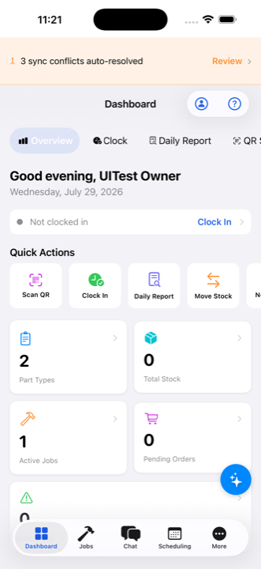
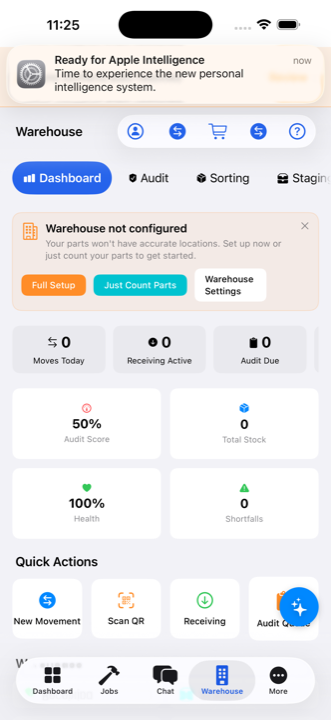
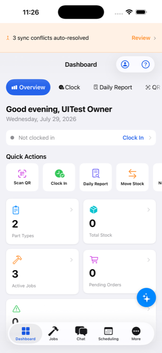

# WiredPart

**The electrician's field app that never needs a signal.**

Parts, panels, purchasing, jobs, and warehouse — built for electricians first,
especially crews working remote sites with little or no cell or Wi-Fi service.
Everything works completely offline; your data lives encrypted on your own
devices and syncs directly between them when they're near each other. No cloud.
No accounts. No signal required, ever.

[](https://testflight.apple.com/join/may2fTH9)


<p align="center">
  
  &nbsp;
  
  &nbsp;
  
</p>

## Why WiredPart

Most field apps assume you have bars. Electricians work in basements,
mechanical rooms, metal buildings, and job sites an hour past the last cell
tower. WiredPart is **local-first by design**:

- **Zero-signal operation** — every feature works with no connection at all.
- **Your data stays yours** — encrypted SQLite on-device (SQLCipher); syncs
  device-to-device over Bluetooth / local Wi-Fi (Apple Multipeer). There is no
  server, no account, no tracking. The App Store privacy label is simply
  **"Data Not Collected."**
- **On-device AI** — Apple Intelligence answers questions and drives filters
  with nothing sent off the phone. Works in a faraday cage.

## What it does today

| | |
| --- | --- |
| 🔩 **Parts & inventory** | Full catalog with categories, brands, suppliers, pricing tiers, MIN/TARGET/MAX stock rules, low-stock alerts, forecasting, QR part labels |
| 🏭 **Warehouse** | Guided movement wizard, floor plans, bin locations, receiving, staging, returns, rolling audits with search |
| 🧾 **Orders & purchasing** | Job parts orders → purchase orders in one lifecycle, procurement planner, supplier preferences, PDF bundles, approvals |
| 🛠️ **Jobs & labor** | Clock in/out with GPS, questionnaires, daily reports, job costing rollups, budget alerts, per-job notebooks |
| 🚚 **Fleet & tools** | Vehicles, trailers, inspections, maintenance, mileage; tool registry with kits, checkout/return |
| 👷 **People & scheduling** | Employees, certifications, permissions, calendar, dispatch board, time off |
| 📊 **Reports** | Timesheets, spending, daily summaries, pre-billing exports with period locking |

## Beta status — what's solid, what's rough, what's next

The app is in **open beta**. Beta testers are real users and every report
shapes the release.

**Solid in this beta:** the daily loop — parts catalog and stock, warehouse
movements and audits, jobs with clock/labor/daily reports, JPO→PO ordering,
fleet, tools, scheduling, reports.

**In beta, still hardening:** device-to-device sync (encryption and conflict
review recently reworked), Chat / Q&A / RFIs, AI assistant coverage across
every page.

**Not ready yet / planned:**
- **Panel Schedule Builder Pro** — build panel schedules fast (tandems, quads,
  phase balance) and print a professional company-letterhead schedule for
  permanent install in the panel. Design is complete
  ([plan](docs/plans/panel-schedule-builder-visual-redesign.md)); implementation
  is queued.
- Alternate app icons and native Icon Composer variants.
- Internet/remote sync between shops (on hold — local sync first).
- Desktop/Mac distribution (the iOS app is the product for now).

## 🚀 Join the beta

1. Install TestFlight on your iPhone or iPad.
2. Tap **[Join the WiredPart beta](https://testflight.apple.com/join/may2fTH9)**.
3. First launch runs a local setup wizard — create your admin PIN and go.
4. Found something broken or missing? Send it right from TestFlight
   (screenshots welcome) or open a
   [GitHub issue](https://github.com/xXKillerNoobYT/Weird-Part-Run-2/issues).
   The [Beta Tester Guide](docs/BETA-TESTER-GUIDE.md) covers install, first
   launch, and reporting in detail.

> Screenshots in this README are iOS Simulator captures using synthetic demo
> data only — see [the asset register](docs/readme-assets/README-ASSET-REVIEW.md).

---

## For developers

Native SwiftUI app backed by a shared Swift package. The app is intentionally
local-first: core business rules live in `core/Sources/WiredPartCore` where
they can be tested without booting the UI; SwiftUI feature screens stay thin.

### Start Here

| Need | Read |
| --- | --- |
| What the app can do (feature overview) | [docs/FEATURES.md](docs/FEATURES.md) |
| Beta testing: install, first launch, report bugs | [docs/BETA-TESTER-GUIDE.md](docs/BETA-TESTER-GUIDE.md) |
| Build or test locally | [docs/SETUP.md](docs/SETUP.md) |
| Pick the right code area | [docs/WORKING-AREAS.md](docs/WORKING-AREAS.md) |
| Verify a change | [docs/QA-PROCESS.md](docs/QA-PROCESS.md) |
| Current staged roadmap | [docs/plans/staged-paperclip-goals.md](docs/plans/staged-paperclip-goals.md) |
| Dependency and runner notes | [docs/DEPENDENCIES.md](docs/DEPENDENCIES.md) |
| Design philosophy | [docs/KEY-PRINCIPLES.md](docs/KEY-PRINCIPLES.md) |
| Historical implementation context | [docs/DEVELOPMENT-HANDOFF.md](docs/DEVELOPMENT-HANDOFF.md) |

### Repository Map

```text
Weird-Part-Run-2/
├── Weird Parts.xcworkspace/          workspace entry point (schemes: WiredPart-iOS,
│                                     Stage-9 smokes, WiredPartCore)
├── Weird Parts IOS/
│   ├── Weird Parts.xcodeproj/        iOS Xcode project (scheme: "Weird Parts")
│   ├── Weird Parts IOS/              SwiftUI app target
│   ├── Weird Parts IOSTests/         app-level unit/regression tests
│   └── Weird Parts IOSUITests/       XCUITest suites and launch tests
├── core/
│   ├── Package.swift                 WiredPartCore Swift package
│   ├── Sources/WiredPartCore/        models, services, database, sync, AI, QR/OCR
│   └── Tests/WiredPartCoreTests/     Swift Testing package tests
├── docs/                             setup, QA, plans, trackers, runbooks
├── scripts/                          repo hygiene, GitHub/Paperclip sync, guards
├── tests/                            static/repo-level checks
├── tools/                            local developer utilities
└── xcode-ai/                         AI-agent prompts, skills, and observations
```

### Architecture

| Area | Technology |
| --- | --- |
| App UI | SwiftUI, iOS app target in `Weird Parts IOS/` |
| Shared domain core | Swift Package Manager library `WiredPartCore` |
| Database | GRDB.swift with SQLCipher-backed pinned dependency |
| Sync | Local-first service layer, LAN/peer sync surfaces, device trust primitives |
| AI/OCR/QR | Apple Foundation Models surfaces where available, Vision, AVFoundation |
| Tests | Swift Testing for core package, Xcode test plans/XCUITest for app flows |
| Automation | GitHub Actions plus local self-hosted Mac runner for Xcode/iOS work |

### Feature Areas

| Area | Purpose | Primary App Path |
| --- | --- | --- |
| Dashboard | KPIs, alerts, quick actions | `Features/Dashboard` |
| Parts | catalog, categories, brands, suppliers, pricing, forecasting, import/export | `Features/Parts` |
| Warehouse | locations, movements, receiving, staging, returns, audits, trailers | `Features/Warehouse` |
| Jobs | job lifecycle, labor, clock, questionnaire, daily reports | `Features/Jobs` |
| Orders | JPOs, purchase orders, returns, procurement, approvals | `Features/Orders` |
| Fleet | vehicles, trailers, inspections, maintenance, mileage, fuel | `Features/Fleet` |
| People | employees, customers, contacts, hats, teams, permissions | `Features/People` |
| Scheduling | calendar, dispatch, time off, templates, availability | `Features/Scheduling` |
| Tools | tool registry, kits, checkout, maintenance | `Features/Tools` |
| Notebooks | all notebooks, templates, job notebooks | `Features/Notebooks` |
| Reports | timesheets, spending, daily summaries, pre-billing exports | `Features/Reports` |
| Chat | messages, Q&A, RFIs | `Features/Chat` |
| Office | office management dashboards and admin workflows | `Features/Office` |
| Settings | company config, security, sync, theme, devices, AI settings | `Features/Settings` |

### Common Commands

```bash
# Core package tests
cd core
swift test

# Static artifact guard from repo root
python3 scripts/guard-tracked-artifacts.py

# Xcode app build/test from repo root; choose an installed simulator
xcodebuild \
  -project "Weird Parts IOS/Weird Parts.xcodeproj" \
  -scheme "Weird Parts" \
  -destination 'generic/platform=iOS Simulator' \
  build
```

For PR validation that needs iOS/macOS/Xcode, prefer the repository's local self-hosted Mac runner labels documented in [docs/QA-PROCESS.md](docs/QA-PROCESS.md). Do not call a WPR2 PR blocked only because GitHub-hosted macOS capacity or billing is unavailable until the local runner state has been checked.

### Work Rules

- Keep generated/runtime files out of commits. Run `python3 scripts/guard-tracked-artifacts.py` before handing off.
- Put domain rules in `WiredPartCore` first when practical, then adapt them in the app.
- Add or update the smallest relevant test for behavior changes.
- Capture UI evidence for user-facing changes: route/screen, device or simulator, viewport/orientation, command, and result.
- Link the GitHub issue and Paperclip ID in docs, PRs, and handoff comments when a change is part of tracked work.

### Tracking

- GitHub: [xXKillerNoobYT/Weird-Part-Run-2#942](https://github.com/xXKillerNoobYT/Weird-Part-Run-2/issues/942)
- Paperclip parent: `WEI-3096` · active implementation: `WEI-3099` · QA review: `WEI-3100`

## License

Private repository. All rights reserved.
